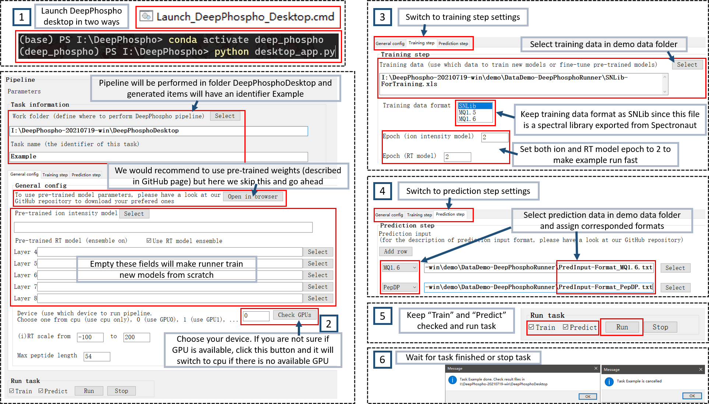
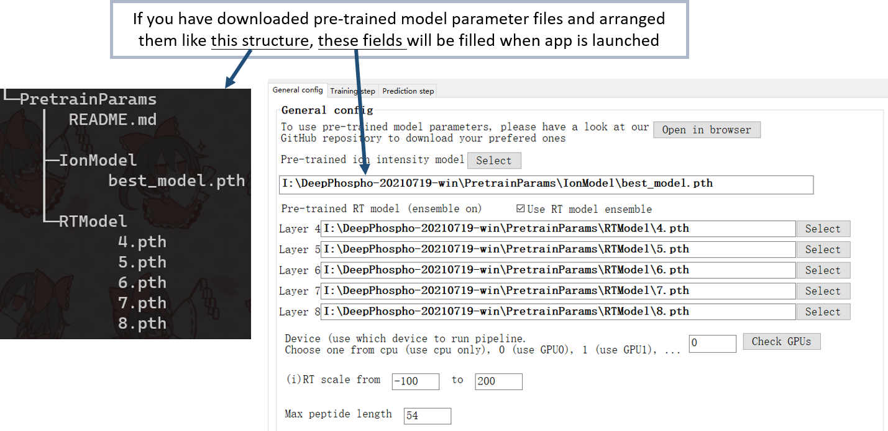
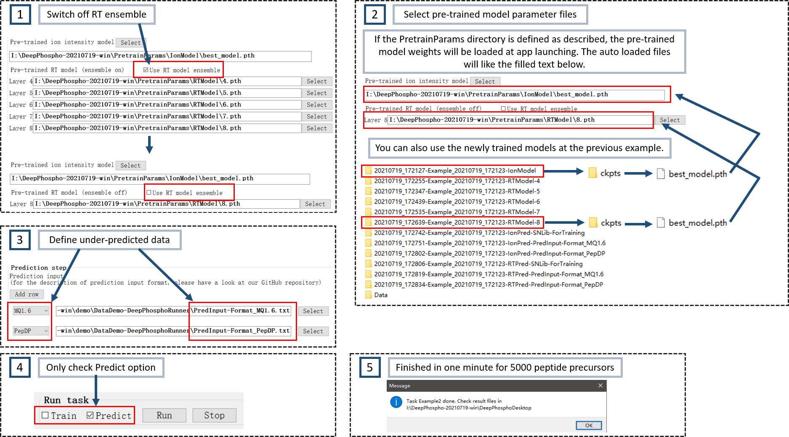

# DeepPhospho: impoves spectral library generation for DIA phosphoproteomics

## Contents

* [Setup DeepPhospho](#setup)
  * [Basic steps (these steps are necessary to run DeepPhospho)](#basic_steps)
    * [Get DeepPhospho](#get)
    * [Python enviroment](#python_env)
  * [Optional steps (these steps will make the use experience better)](#optional_steps)
    * [Download pre-trained model parameters](#down_pretain)
    * [Use GPU](#use_gpu)
  * [Use DeepPhospho desktop with graphical interface](#use_gi)
* [Examples (DeepPhospho runner and desktop)](#examples)
  * [Example 1 (complete pipeline for training and prediction)](#exp_1)
  * [Example 2 (use existed model weight files to do prediction without training and turn off RT ensemble)](#exp_2)
* [Introduce to DeepPhospho runner](#intro_runner)
  * [Runner supported training data formats](#runner_train_formats)
  * [Runner supported prediction data formats](#runner_pred_formats)
  * [Description of runner arguments](#runner_argu)
  * [Command template](#command)
  * [Example](#runner_exp)
* [DeepPhospho configs](#configs)
  * [Configs for ion intensity model](#ion_config)
  * [Configs for RT model](#rt_config)
  * [Use config file and overwrite values with command line arguments](#import_config)
* [Train and predict manually](#manually)
  * [Start demo for model training](#train_demo)
  * [Prepare customized training data](#prepare_train_data)
  * [Start demo for prediction](#pred_demo)
  * [Prepare customized prediction input](#prepare_pred_data)
  * [Generate ready to use spectral library](#gen_lib)
* [License](#license)
* [Publication](#pub)

# <span id="setup">Setup DeepPhospho</span>

## <span id="basic_steps">Basic steps</span>

### <span id="get">Get DeepPhospho</span>

* The direct way to get DeepPhospho is to clone this repository via git or download this repository on GitHub page

  ```
  # Clone this repo
  git clone https://github.com/weizhenFrank/DeepPhospho.git
  # or download repo
  https://github.com/weizhenFrank/DeepPhospho
  ```

* We also provided a zip file in [release page](https://github.com/weizhenFrank/DeepPhospho/releases). This file packed not only DeepPhospho source code, but also a python enviroment which contains all required packages for DeepPhospho. But what should be noticed is this file will be very large compared to source code only, since pytorch and its dependencies take much space

### <span id="python_env">Setup python environment</span>

* If you downloaded the zip file on GitHub release page, please skip this step

* DeepPhospho relies on PyTorch and some common packages like numpy. If you want to use DeepPhospho desktop, wxpython is also required.

* We provided a conda enviroment config file to make the installation of required packages easily. Please find the yaml file in the DeepPhospho main folder, named DeepPhospho_ENV.yaml

  ```shell
  # use the following command to create a conda enviroment with required packages
  conda env create -f DeepPhospho_ENV.yaml -n deep_phospho
  ```

## <span id="optional_steps">Optional steps</span>

### <span id="down_pretain">Download pre-trained model parameters</span>

* We would recommand to do fine-tuning on pre-trained model weights instead of training a new one from scratch, since this will make the training easier

* Here, we provided five groups of pre-trained weights, and each group contains one ion intensity model and five RT models (for ensemble). The last four groups are based (fine-tuned) on the first one. And the middle three groups are those used in our paper. All five groups are stored in [PRIDE](https://www.ebi.ac.uk/pride/archive/projects/PXD025112) (with prefix `DeepPhosphoModels-`) and the first one is additionally stored in [Google drive](https://drive.google.com/drive/folders/1ETJEG-8lobVJWaYOBMnqUL1G5dUHRI2B)

  * PretrainParams: this one is recommanded to use if you want to do fine-tuning with your own data
  * U2OS_DIA
  * RPE1_DIA
  * Dilution_DIA
  * RPE1_DDA

* We would also recommand to arrange the downloaded pre-trained weights of **PretrainParams** as following structure in DeepPhospho main folder, which matches the default setting in current config files and can be automatically detected by DeepPhospho runner or DeepPhospho desktop

  ```
  DeepPhospho
  |---- PretrainParams
     |---- IonModel
        |---- best_model.pth
     |---- RTModel
        |---- 4.pth
        |---- 5.pth
        |---- 6.pth
        |---- 7.pth
        |---- 8.pth
  ```

### <span id="use_gpu">Use GPU</span>

* DeepPhospho can be runned with GPU or with only CPU
* To use GPU, please confirm the information of your device and install suitable drive ([CUDA](https://developer.nvidia.com/cuda-downloads) (10.1 is recommended if you would like to use the conda enviroment provided in this repository) and [cuDNN](https://developer.nvidia.com/cudnn))

## <span id="use_gi">Use DeepPhospho desktop with graphical interface</span>

* If you have downloaded the zip file from [release page](https://github.com/weizhenFrank/DeepPhospho/releases), there will be a file named `Launch_DeepPhospho_Desktop.cmd`, double click this file will launch the DeepPhospho desktop

* If DeepPhospho is downloaded in the [GitHub main page](https://github.com/weizhenFrank/DeepPhospho) (https://github.com/weizhenFrank/DeepPhospho) or via git clone, a python enviroment is needed. Please follow the previous section [Setup python environment](#python_env) to prepare a required runtime enviroment, and use `desktop_app.py` as the entry

  ```
  python desktop_app.py
  ```

# <span id="examples">Examples (DeepPhospho runner and desktop)</span>

* Here, we would like to show some examples to use DeepPhospho runner and DeepPhospho desktop. Although the user interface of these two tools are based on command line and graphic, respectively, most of the usages of them are one-to-one matched.
* Before start, please check some files in this folder: `/demo/DataDemo-DeepPhosphoRunner`. There are three files named
  * SNLib-ForTraining.xls (a spectral library file exported from Spectronaut)
  * PredInput-Format_MQ1.6.txt (a search result file from MaxQuant) (in practical use, both evidence.txt and msms.txt are ok)
  * PredInput-Format_PepDP.txt (a tab-separate two-column file, with modified peptide and related charge state) (the peptide format in this file is called `PepDP`, which is used in DeepPhospho)
* The three data files defined above are only small parts of original files, to make examples run faster.
* You can also prepare your own data for training and prediction. Have a look at currently DeepPhospho runner supported [training data formats](#runner_train_formats) and [prediction input file formats](#runner_pred_formats)

## <span id="exp_1">Example 1 (complete pipeline for training and prediction)</span>

* In this example, we will run the complete pipeline to do training and prediction. The schematic diagram is shown below

* Before introduce the GUI configs, the equivalent command with runner is

  ```shell
  python I:\DeepPhospho-20210719-win\run_deep_phospho.py -w I:\DeepPhospho-20210719-win\DeepPhosphoDesktop -t Example -tf I:\DeepPhospho-20210719-win\demo\DataDemo-DeepPhosphoRunner\SNLib-ForTraining.xls -tt SNLib -pf I:\DeepPhospho-20210719-win\demo\DataDemo-DeepPhosphoRunner\PredInput-Format_MQ1.6.txt -pt MQ1.6 -pf I:\DeepPhospho-20210719-win\demo\DataDemo-DeepPhosphoRunner\PredInput-Format_PepDP.txt -pt PepDP -d 0 -ie 2 -re 2 -ibs 64 -rbs 128 -lr 0.0001 -ml 54 -rs *-100,200 -en -train 1 -pred 1 -m
  ```

* First, launch DeepPhospho desktop with cmd file or run in python

* Then, at general config panel, check the Device to define use cpu or gpu

* Switch to training step panel, select training data in demo folder, and set epoch of ion model and RT model to 2 to save time for example

* Switch to prediction step panel, select two prediction files and choose correct file type

* Make sure both `Train` and `Predict` in `Run task` section are checked, and click `Run`



* In the above example, to run this example quickly without waiting to download pre-trained model weights, the fields of pre-trained model parameter files are empty. These fields can be selected by user self, and can also be filled automatically with pre-defined folder structure like below
* NOTICE: The total 6 pre-trained text contents (1 for ion model and 5 for RT models) are not necessary to be all filled or all empty. For example, if the RT models are all filled and ion model is empty, ion model will be trained from initial while RT models will be fine-tuned on pre-trained weights



## <span id="exp_2">Example 2 (use existed model weight files to do prediction without training and turn off RT ensemble)</span>

* Sometimes we would want to do prediction and generate libraries with previously trained models

* And do not use RT ensemble to save both training time and prediction time

* In this example, we will use pre-trained ion model and RT model to do prediction and no RT ensemble will be performed. This case would take very short time to finish

* The equivalent runner command is

  ```shell
  python I:\DeepPhospho-20210719-win\run_deep_phospho.py -w I:\DeepPhospho-20210719-win\DeepPhosphoDesktop -t Example2 -pf I:\DeepPhospho-20210719-win\demo\DataDemo-DeepPhosphoRunner\PredInput-Format_MQ1.6.txt -pt MQ1.6 -pf I:\DeepPhospho-20210719-win\demo\DataDemo-DeepPhosphoRunner\PredInput-Format_PepDP.txt -pt PepDP -d 0 -ie 2 -re 2 -ibs 64 -rbs 128 -lr 0.0001 -ml 54 -rs *-100,200 -train 0 -pred 1 -pretrain_ion I:\DeepPhospho-20210719-win\PretrainParams\IonModel\best_model.pth -pretrain_rt_8 I:\DeepPhospho-20210719-win\PretrainParams\RTModel\8.pth -m
  ```

* After DeepPhospho desktop is launched, turn off RT model ensemble to use only layer 8 for RT model

* If PretrainParams folder is defined as above, the ion model and RT model param files will be auto detected as below, and you can also use the newly trained models at Example 1

* Turn off Train task and only check Predict to do prediction only



# <span id="intro_runner">Introduce to DeepPhospho runner</span>

* To generate a ready-to-use spectral library from an input data will always need the following steps:
  1. Convert the input training data to model compatible format
  2. Fine-tune the pre-trained model parameters to fit the under-analyzed data better
  3. Convert the input prediction data to model compatible format
  4. Predict the ion intensity and retention time of expected data
  5. Generate a spectral library
* To make DeepPhospho easier to use, we provide an all-in-one script to automatically transform initial data, train and select the best model parameter, predict, and generate the final library, called DeepPhospho runner
* The time cost depends on the size of data and whether enables rt model ensemble. If you run this script with CPU and have a large dataset to train models, we recommand to not use `-en`

## <span id="runner_train_formats">Runner supported training data formats</span>

* Currently, runner supports the following training data formats
  * SNLib - Spectronaut library
  * MQ1.5 - MaxQuant msms.txt (with MQ version <= 1.5, the phospho-modification is annotated as "(ph)")
  * MQ1.6 - MaxQuant msms.txt (with MQ version >= 1.6, the phospho-modification is annotated as "(Phospho (STY))")

## <span id="runner_pred_formats">Runner supported prediction data formats</span>

* Currently, runner supports the following prediction data formats
  1. SNLib - Spectronaut library exported in .xls format
  2. SNResult - Spectronaut search result
  3. MQ1.5 - evidence.txt or msms.txt file from MaxQuant with version <= 1.5
  4. MQ1.6 - evidence.txt or msms.txt file from MaxQuant with version >= 1.6
  5. PepSN13 - Spectronaut 13+ peptide format like \_[Acetyl (Protein N-term)]M[Oxidation (M)]LSLS[Phospho (STY)]PLK\_
  6. PepMQ1.5 - MaxQuant 1.5- peptide format like \_(ac)GS(ph)QDM(ox)GS(ph)PLRET(ph)RK\_
  7. PepMQ1.6 - MaxQuant 1.6+ peptide format like \_(Acetyl (Protein N-term))TM(Oxidation (M))DKS(Phospho (STY))ELVQK\_
  8. PepComet - Comet peptide format like n#DFM\*SPKFS@LT@DVEY@PAWCQDDEVPITM\*QEIR
  9. PepDP - DeepPhospho used peptide format like *1ED2MCLK
* [notice]
  * The first four types 1-4 are files generated by corresponded softwares
  * The last five types 5-9 (Pep + xxx) are tab-separated two-column file, has "peptide" to store the modified peptides with certain format and "charge" to store the precursor charge

## <span id="runner_argu">Description of runner arguments</span>

### Task information

* `-w` or `--work_dir`
  * work directory
  * All operations will be performed in this directory, so-called work directory
  * If not passed, this will be {start_time}-DeepPhospho-WorkFolder
* `-t` or `--task_name`
  * "task name"
  * This will be added to all generated files or folders as an identifier
  * If not passed, this will be Task_{start_time}
* `-no_time` or `--no_time`
  * "no time"
  * In default, there will be a suffix added to the name of task and name of each training and prediction instance. The suffix is the certain time of that step, which is used to classify same task name but runned in different time.
  * If `-no_time` is passed, the above step will not happen

### Data files and formats

* `-tf` or `--train_file`
  * "train file"
  * This should point to the path of expected data for model training
* `-tt` or `--train_file_type`
  * "train file type (source)"
  * See the following section for details [Runner supported training data formats](#runner_train_formats)
* `-pf` or `--pred_file`
  * "prediction file"
  * This argument is able to receive multi files
  * Either `-pf fileA fileB fileC` or `-pf fileA -pf fileB -pf fileC` is valid, and the mix of these two ways is also fine, like `-pf fileA -pf fileB fileC`
* `-pt` or `--pred_file_type`
  * "prediction file type"
  * When multi files are passed to `-pf`, `-pt` should be defined only once and the file format will be assigned to all files, or the same number of `-pt` should be defined, and this also support the mix ways as `-pf`
  * See the following section for details [Runner supported prediction data formats](#runner_pred_formats)

### Pre-trained model weights

* `-pretrain_ion` or `--pretrain_ion_model`
  * Fine-tune on pre-trained ion model parameters or directly use this model to do prediction. 
  * This will be automatically filled-in if pre-trained models param file is existed as "PretrainParams/IonModel/best_model.pth". 
  * If you don't want to use pre-trained model param anywhere, please explicitly define this argument and set value to `/`
* `-pretrain_rt_{l}` or `--pretrain_rt_model_{l}`
  * Fine-tune on pre-trained RT model parameters (with `l` encoder layer) or directly use pre-trained models to do prediction. 
  * This will be automatically filled-in if pre-trained models param files are existed as "PretrainParams/IonModel/(layer_number).pth"
  * If -en (-ensemble_rt) is not used, only -rt_model_8 is required
  * If you don\'t want to use pre-trained model param anywhere, please explicitly define this argument and set value to `/`
* `-skip_ion_finetune` or `--skip_ion_finetune`
  * Partial training option
  * When this argument is passed, ion model fine-tuning step will be skipped. While RT model training will still be performed if -skip_rt_finetune_{layer_number} is not passed
  * This will be useful if you already have a fine-tuned ion model but have no or only some of fine-tuned RT models, and still want to use DeepPhospho runner but not individual train/prediction scripts
* `-skip_rt_finetune_{l}` or `--skip_rt_finetune_{l}`
  * Partial training option
  * When this argument is passed, RT model fine-tuning step for layer `l` will be skipped. Use existed RT model parameters (with `l` encoder layer) instead of training a new one
  * This will be useful if you already have some fine-tuned RT model but not enough for ensemble, or RT model has already been trained but ion model is need to be fine-tuned. In this case, you can still use DeepPhospho runner but not individual train/prediction scripts. 

### Hyper-params

* `-e` or `--epoch`
  * Train how much epochs for both ion an RT models. This will only be effective for one of ion or RT model when -ie (--ion_epoch) or -re (--rt_epoch) is provided. Or no effect when both -ie and -re are provided. Default is 30
* `-ie` or `--ion_epoch`
  * Train how much epochs on ion model. Default is 30
* `-re` or `--rt_epoch`
  * Train how much epochs on RT model. Default is 30
* `-ibs` or `--ion_batch_size`
  * Batch size for ion model training. Default is 64
* `-rbs` or `--rt_batch_size`
  * Batch size for RT model training. Default is 128
* `-lr` or `--learning_rate`
  * Initial learning rate for two models. Default is 0.0001 while a smaller value is recommanded if the size of training data is small (e.g. hundreds of precursors)
* `-ml` or `--max_len`
  * Max length of peptide
* `-rs` or `--rt_scale`
  * Define the lower and upper limitations for RT model
  * Separate two numbers with a comma like `0,10`. And a `*` will be needed for negative number, like `*-100,200`. Default is `*-100,200` (-100 to 200)
* `-en` or `--ensemble_rt`
  * "use ensemble RT model"
  * If passed, ensemble RT model (total five with different transformer encoder layers 4, 5, 6, 7, and 8) will be used to improve the predicted RT accuracy. This will increase the RT model training time by 5 times accordingly

### Task control

* `-train` or `--train`
  * Perform training or not. Default as 1 to do training, and set to 0 to not perform training
* `-pred` or `--predict`
  * Perform prediction or not. Default as 1 to do prediction, and set to 0 to not perform prediction
* `-d` or `--device`
  * "used device"
  * For training and prediction, this argument can be `cpu` to use CPU only, or `0` to use GPU0, `1` to use GPU1, ...
* `-m` or `--merge`
  * "merge all library to one"
  * If passed, a final library consist of all predicted data will be generated (the individual ones will also be kept)

## <span id="command">Command template</span>

* Before run this script, please activate the conda enviroment and set directory to DeepPhospho

  ```shell
  cd /path/of/DeepPhospho  # for windows cmd and prompt, type d: or e: to switch to expected drive first
  conda activate deep_phospho
  ```

* Below is a command template, and each argument will be introduced after it

  ```shell
  python run_deep_phospho.py -w ./WorkFolder -t task_name -tf ./msms.txt -tt MQ1.6 -pf ./evidence.txt Lib.xls -pt MQ1.6 SNLib -d 0 -en -m
  ```

## <span id="runner_exp">Example</span>

* Please have a look at the files in folder `./demo/DataDemo-DeepPhosphoRunner`

  * A training data for fine-tuning on pre-trained model parameters is in a Spectronaut library format, named "SNLib-ForTraining.xls"
  * Two files as the input for prediction are in two formats
    * PredInput-Format_MQ1.6.txt is a `evidence.txt` file generated by MaxQaunt (version >= 1.6)
    * PredInput-Format_PepDP.txt is a tab-separate two-column file with title `peptide` and `charge`, and the peptides are in DeepPhospho format

* In this case, we can run the following command (in linux, please replace `\` to `/`)

  ```shell
  conda activate deep_phospho
  cd D:\path\to\DeepPhospho
  python .\run_deep_phospho.py -w .\demo\Demo-DeepPhosphoRunner -t TestRunner -tf .\demo\DataDemo-DeepPhosphoRunner\SNLib-ForTraining.xls -tt SNLib -pf .\demo\DataDemo-DeepPhosphoRunner\PredInput-Format_MQ1.6.txt -pt MQ1.6 -pf .\demo\DataDemo-DeepPhosphoRunner\PredInput-Format_PepDP.txt -pt PepDP -d cpu -e 2 -en -m
  ```

* Then, the runner will start as defined:

  * The work folder is in folder `/demo` and named `Demo-DeepPhosphoRunner`
  * We name this task as `TestRunner`
  * The training data is defined as `SNLib-ForTraining.xls` with `SNLib` format
  * Two prediction data are defined as `PredInput-Format_MQ1.6.txt` with `MQ1.6` format and `PredInput-Format_PepDP.txt` with `PepDP` format
  * CPU is defined as the device for this task (change to 0 or 1 or 2... to use corresponded GPU)
  * To quickly run this demo, we set epoch to 2 (the default value is 30)
  * Ensemble RT model is used

* When this task is finished, all files including used command, defined configs, intermediate files, models, predictions, generated libraries will be stored in the work folder `Demo-DeepPhosphoRunner`

* If `-m` is defined, all libraries will be merged to a single one. To manurally select some ones to merge, run the following command (suppose we are going to merge generated libraries libA libB and libC to `output_library.xls`)

  ```shell
  python build_spec_lib.py merge -l libA libB libC -o output_library.xls
  ```

# <span id="configs">DeepPhospho configs</span>

* In this section, we will introduce the configs for ion and rt models

## <span id="ion_config">Configs for ion intensity model</span>

* Here we use config_ion_model.py as an example
* WorkFolder can be set to 'Here' indicates the dir to run script, or other specific path
* ExpName is the experiment name of this time, it will be an identifier and empty is also fine
* InstanceName will fully overwrite the instance name which was defined as the combination of ExpName, DataName and some other information as default
* TaskPurpose can be set to one of 'Train' or 'Predict' (case is ignored)
* PretrainParam is used
  * as pre-trained parameter for fine-tuning, and it can be empty in training mode to train the parameters ab initio
  * as model parameter to load for predicting, and it must be pointed to an vailid path of parameter file
* Intensity_DATA_CFG
  * DataName is used as the identifier of this dataset
  * The two setting groups below will have one to be ignored according to the TaskPurpose
    1. for training
       * TrainPATH, TestPATH, and HoldoutPATH are used to train model, and Holdout can be empty
    2. for prediction
       * PredInputPATH is defined as the prediction input
       * InputWithLabel can be True or False. If True, the evaluation will be done if the label is provided in the prediction input
  * MAX_SEQ_LEN will limit the max peptide length for either training and prediction. Though it is possible to predict any peptide longer than this setting, we recommended to train a new model for the specific length
  * We use cache (pickle) to make the data loading more quickly, and refresh_cache will re-pickle the input data
* MODEL_CFG
  * For ion intensity model, only MODEL_CFG (LSTMTransformer) is available and please make sure the UsedModelCFG is set to this one
  * In json format, just change the values in UsedModelCFG
* TRAINING_HYPER_PARAM
  * GPU_INDEX can be set to '0', '1', '2', ... or 'cpu', and corresponded GPU device or CPU will be used
  * EPOCH can be set to positive integer, 30 is recommended for fine-tuning
  * BATCH_SIZE is recommended to be set as $2^n$ according to the memory of your device

## <span id="rt_config">Configs for RT model</span>

* Config for RT model is similar as ion model. Some ones different are listed below
* PretrainParam is only used for fine-tuning if it is provided. Instead, ParamsForPred will be used as the params for prediction to be loaded
* MIN_RT and MAX_RT are used to scale the input to 0-1 and unscale the output to this range
* To train or fine-tune RT model, MODEL_CFG (LSTMTransformer) will be used, and Ensemble_MODEL_CFG (LSTMTransformerEnsemble) is used for prediction
  * To train a RT model and in .py config mode, change num_encd_layer for MODEL_CFG and set UsedModelCFG to MODEL_CFG
  * To predict RT in .py config mode, change UsedModelCFG to Ensemble_MODEL_CFG and num_encd_layer will be ignored
  * To train a RT model in .json config mode, change num_encd_layer in UsedModelCFG and set model_name to 'LSTMTransformer'
  * To predict RT in .json config mode, set model_name to 'LSTMTransformerEnsemble'
* The ensembl is implemented by changing the num_encd_layer (number of transformer encoder layer) of each model, and we provided 4, 5, 6, 7, 8 five pre-trained parameters

## <span id="import_config">Use config file and overwrite values with command line arguments</span>

* Configs can be imported through two kind of config files (.py format or .json format)

* For both ion intensity model and RT model, there are three ways to specify the config files:

  1. directly change the config file 'config_ion_model.py' or 'config_rt_model.py' and run scripts with no further changes

  2. fill in config template files in json format (stored in DeepPhospho main folder) and fill 'config_path' in train or pred script

  3. fill in config template files in json format and pass it as an argument

     ```shell
     python train_ion.py path/to/your/config.json
     ```

* For convenient use, we also provided an argument parser

  * `-c path/to/your/config.json` will force the config file to be set as the file you provided in command line
  * `-g [int] or -g cpu` will overwrite the GPU_INDEX in config, this will be useful to start multi tasks on different device in one time
  * `-l [int]` will overwrite the num_encd_layer in config, which indicates the encoder layer number of transformer
  * -e and -d will overwrite experiment name and dataset name, respectively

* For more information, run `python [any train or pred script] --help`

# <span id="manually">Train and predict manually</span>

## <span id="train_demo">Start demo for model training</span>

* We provided a demo for ion intensity model and RT model fine-tuning based on our pre-trained parameters. And the dataset RPE1 DIA used in this demo is also the data for EGF phospho-signaling analysis in our paper
* Before start this, please make sure these files are existed and in correct format
  * In folder demo/RPE1_DIA_demo_data, two files for ion model and two files for RT model are existed and please unzip the zipped ones
  * For demo of ion intensity model, best_model.pth should exist in folder PretrainParams/IonModel
  * For demo of RT model, 4.pth should exist in folder PretrainParams/RTModel
* Below is the training steps
  * Open command line (prompt in windows or any shell in linux) and change the conda enviroment to deep_phospho
  * Change directory to DeepPhospho main folder
  * run `python train_ion.py ./demo/ConfigDemo-IonModel-RPE1_DIA-Finetune_ion_model.json` to start ion intensity model fine-tuning
    * [Notice] the GPU_IDX in this config file is set to "0", if you want to use cpu only or other device, please change it in the config file or run the following command instead `python train_ion.py -c ./demo/ConfigDemo-IonModel-RPE1_DIA-Finetune_ion_model.json -g cpu`
  * run `python train_rt.py ./demo/ConfigDemo-RTModel-RPE1_DIA-Finetune_rt_model.json` to start RT model fine-tuning based on pre-trained parameters with 4 encoder layer
    * [Notice] the GPU_IDX in this config file is also set to "0"
    * [Notice] we use ensemble model to improve the final performance of RT model, and we provided 5 pre-trained parameters with 4, 5, 6, 7, and 8 encoder layers. The num_encd_layer in this demo config is set to "4" and PretrainParam is "4.pth". To train the same five models, please create five config files and run them substantially, or use one config file and add arguments like `python train_rt.py -c ./demo/ConfigDemo-RTModel-RPE1_DIA-Finetune_rt_model.json -l 5 - p /path/to/5.pth` to fine-tune the RT model param with 5 encoder layers

## <span id="prepare_train_data">Prepare customized training data</span>

* The most obvious obstacles to run released deep learning models are usually the setup of enviroment and the preparation of data with compatible format for each specific model

* Here, we provided some functions to convert formats more easily

* For training data, we now support two formats

  * Spectronaut library (exported as plain text format)
  * MaxQuant search result msms.txt

* After preparation of one training data, run the following script

  ```shell
  python generate_dataset.py train -f library.xls -t SNLib -o ./output_folder
  ```

* As shown above, four arguments should passed to the script

  1. the first is train (the other one is pred and will be introduced in next part)
  2. -f is the expected training data
  3. -t is type or source of the given training data
     * SNLib - library from Spectronaut
     * MQ1.5 - msms.txt file from MaxQuant with version <= 1.5
     * MQ1.6 - msms.txt file from MaxQuant with version >= 1.6 (these two versions have different modified peptide format)
  4. -o is the output folder, here is not a path to output file because four files will be generated, including train and val datasets for both ion and RT models

* For data from other sources, we would like to support them from your generous share of an example data file

* And you can also create the training data file following these rules for ion intensity model

  * The training file is in JSON format, with each precursor as major key, and fragment-intensity pair list as value for each precursor
  * Each key of the dict is a peptide precursor, which as the format like @HEDGHESMVP2TYR.4, * or @ at first position means Acetyl modified or not, and 1, 2, 3, 4 indicate M(ox), S(ph), T(ph), Y(ph) respectively
  * Each value is also a dict to store the fragment-intensity pairs
  * The fragments have format like b5+1-Noloss, b5+1-1,NH3, b5+1-1,H2O, b5+1-1,H3PO4 for 5th b ion with 1 charge state and has no loss, loss 1 NH3, loss 1 H2O, loss 1 H3PO4
  * And the intensity can be any values without normalization (like relative intensity with 100 as max value)


## <span id="pred_demo">Start  demo for prediction</span>

* After running the above two training demos, there will be two folders created in the demo folder, which contain multi files including the trained parameters
* [Notice] In the training demos, we defined the "InstanceName" in config files to make the name of output folders consistent. In general, we recommand to fill in "ExpName" and "DataName" to auto create work folder, which will have start time and some information in the generated name
* run `python pred_ion.py ./demo/ConfigDemo-IonModel-RPE1_DIA-Pred_with_finetuned_parameteres.json` to predict spectra of some peptide precursors with the model parameters fine-tuned just now
* run `python pred_rt.py ./demo/ConfigDemo-RTModel-RPE1_DIA-Pred_with_finetuned_parameteres.json` to predict iRT of some peptides with the model parameters fine-tuned just now
* If you want to use CPU or other GPU device but not "0", add -c before config path and add '-g cpu' or '-g 1', '-g 2', ...

## <span id="prepare_pred_data">Prepare customized prediction input</span>

* We also provided the convertion funcstion for prediction input

* The usage is like training data but change train to pred

  ```shell
  python generate_dataset.py pred -f library.xls -t SNLib -o ./output_folder
  ```

* The following file formats are supported

  1. SNLib - library from Spectronaut
  2. SNResult - search results from Spectronaut
  3. MQ1.5 - evidence.txt or msms.txt file from MaxQuant with version <= 1.5
  4. MQ1.6 - evidence.txt or msms.txt file from MaxQuant with version >= 1.6
  5. PepSN13 - Spectronaut 13+ peptide format like \_[Acetyl (Protein N-term)]M[Oxidation (M)]LSLS[Phospho (STY)]PLK\_
  6. PepMQ1.5 - MaxQuant 1.5- peptide format like \_(ac)GS(ph)QDM(ox)GS(ph)PLRET(ph)RK\_
  7. PepMQ1.6 - MaxQuant 1.6+ peptide format like \_(Acetyl (Protein N-term))TM(Oxidation (M))DKS(Phospho (STY))ELVQK\_
  8. PepComet - Comet peptide format like n#DFM\*SPKFS@LT@DVEY@PAWCQDDEVPITM\*QEIR
  9. PepDP - DeepPhospho used peptide format like *1ED2MCLK

* 1 - 4 is the file from Spectronaut or MaxQuant

* 5 - 9 is tab-separated file with two columns "sequence" and "charge", and total five peptide formats can be assigned for this file. This will be convenient if there is only a peptide list collected from any other data

* If you want to generate prediction input yourself, please following these rules

* For ion model, a single column file with title "IntPrec" and rows with precursor like *1ED2MCLK.2

* For RT model, a single column file with title "IntPep" and rows with peptide lieke *1ED2MCLK

## <span id="gen_lib">Generate ready to use spectral library</span>

* A script to build library from DeepPhospho predicted results with ion intensity and RT is supported
* run `python build_spec_lib.py build -i ion_result.json -r rt_result.txt -o output_library.xls`
* To merge multi (at least two) libraries to one
* run `python build_spec_lib.py merge -l libA libB libC -o output_library.xls`
* [notice] different with dataset generation with generate_dataset.py, the -o output here should be a file path since only one file will be generated

# <span id="license">License</span>

* DeepPhospho is under a general MIT license

# <span id="pub">Publication</span>

* Have a look at our paper in [In Review](https://www.researchsquare.com/article/rs-393214/v1)


